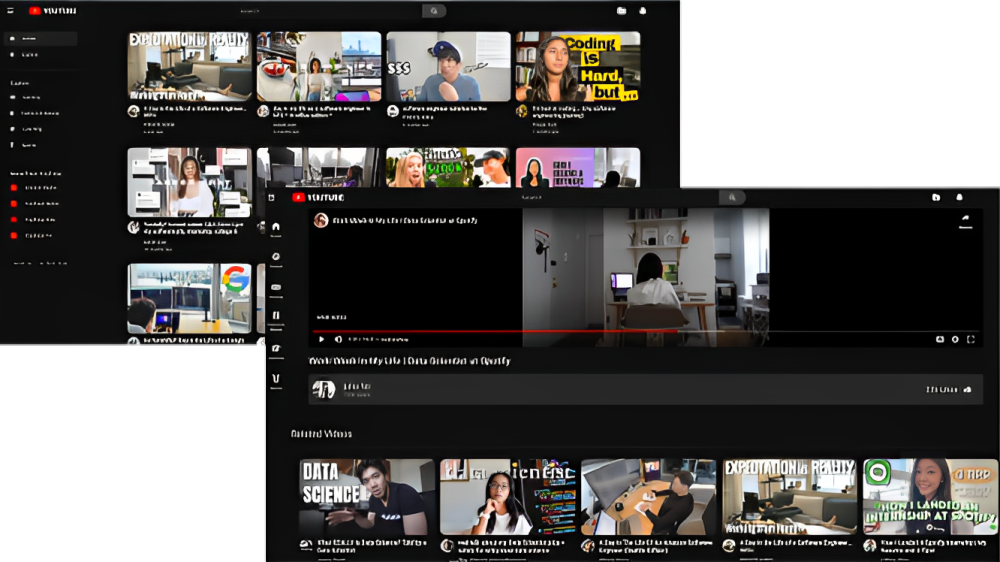

<!DOCTYPE html>
<html lang="en">

<head>
  <meta charset="UTF-8">
  <meta name="viewport" content="width=device-width, initial-scale=1.0">
 
</head>

<body>
  

    
  

  <h1 align="center">FreeTube</h1>
  

    <a href="https://main.d1zasqtam0zsb0.amplifyapp.com/" target="_blank">FreeTube</a> built with <a href="https://reactjs.org/" target="_blank">React</a> and hosted with <a href="https://aws.amazon.com/" target="_blank">AWS</a>
  

   
  

    
  

   
  <blockquote>
    Open Source Version of Youtube without Ads
  </blockquote>
   
  <h2>Built with</h2>
  <pre>
 React
 Redux toolkit
 Scss (CSS pre-processor)
  </pre>
  <h2>Used</h2>
  <pre>
 Vite
 React-Router-Dom
 Rapid API
  </pre>
  <h3>Color Reference</h3>
  <table align="center">
    <tr>
      <th>Color</th>
      <th>Hex</th>
    </tr>
    <tr>
      <td>Bg-Black</td>
      <td>#0f0f0f</td>
    </tr>
    <tr>
      <td>Text-white</td>
      <td>#d3d3d3</td>
    </tr>
    <tr>
      <td>Hover-gray</td>
      <td>#3f3f3f</td>
    </tr>
    <tr>
      <td>Border</td>
      <td>#303030</td>
    </tr>
  </table>
  <h3>Fonts</h3>
  <pre>Roboto</pre>
   
  <h2>About</h2>
  <blockquote>
    Include the ability to be responsive to all screen sizes. 
    Fast and reliable access to videos with Rapid API. 
    Include almost all features that the original YouTube has. 
    Advanced data handling and customization with Redux toolkit. 
    Used Scss to handle design & file management.
  </blockquote>
  

    
    <h6>Developed by <a href="https://github.com/dragonpilee/FreeTube">Sandra Anna Joshy</a></h6>
  

  <footer>
    Contributions - Alan Cyril Sunny
  </footer>
</body>

</html>
